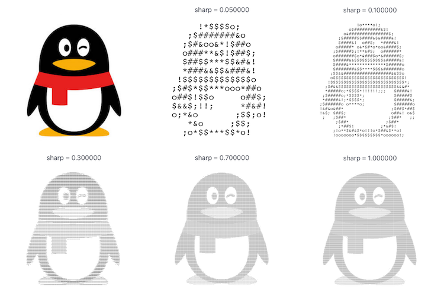

# FNCharMapImageView
Swift 用符号拼成图片的ImageView.

###基础使用Demo：

```
	let imageView = FNCharMapImageView.init(frame: CGRectMake(20, 100, view.frame.size.width - 40, view.frame.size.width - 40))
	view.addSubview(imageView)
	imageView.sharp = Float(sharp)
	imageView.image = UIImage.init(named: "qq")
```

###效果：


###用处：
1. 用符号展示图片；
2. FNImageToText中的方法，可以将图片按照sharp值，将图片转为符号组成的字符串，用在不能传送图片的场景；